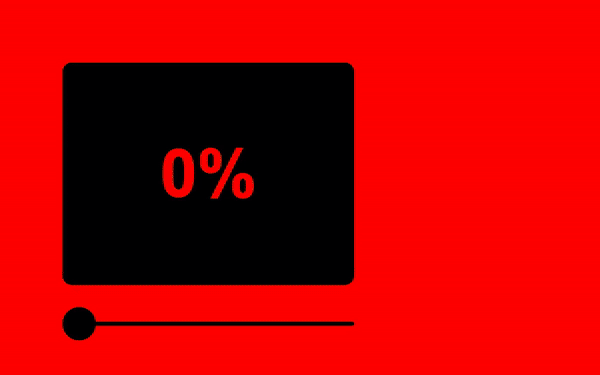

# coloured-success

An ultra lightweight Vanilla JS library that converts a success percentage in the relevant color



## Installation

```
$ npm i coloured-success
```

## Examples

```js
getRgbColorAsSucess(40); //rgb(255,130.05,0)
```

```js
getRgbaColorAsSucess(40, 0.2); //rgba(255,130.05,0,0.2)
```
