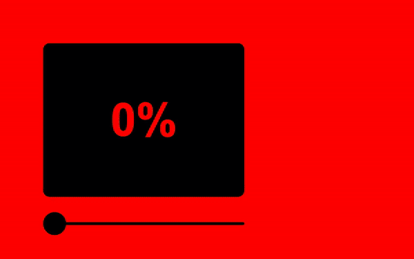
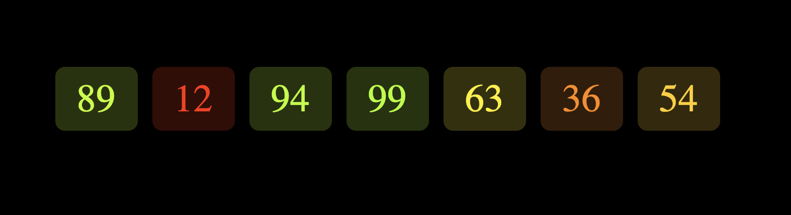

# coloured-success

An ultra lightweight Vanilla JS library that converts a success percentage in the relevant color



## Installation

```
$ npm i coloured-success
```

## Uses

```js
let success = 40; // 0-100

getRgbColorAsSucess(success); //rgb(255,130.05,0)

getRgbaColorAsSucess(success, 0.2); //rgba(255,130.05,0,0.2)
```

## Use with Typescript

```js
import { getRgbColorAsSucess, getRgbaColorAsSucess } from "coloured-success";
```

## Use with Angular

```js

<h1 [style.color]="getRgbColorAsSucess(40)"></h1>

```
```js

<h1 [ngStyle]="{ color: getRgbColorAsSucess(40) }"></h1>

```

## Examples of use

- Metrics
  

- Grades
  
